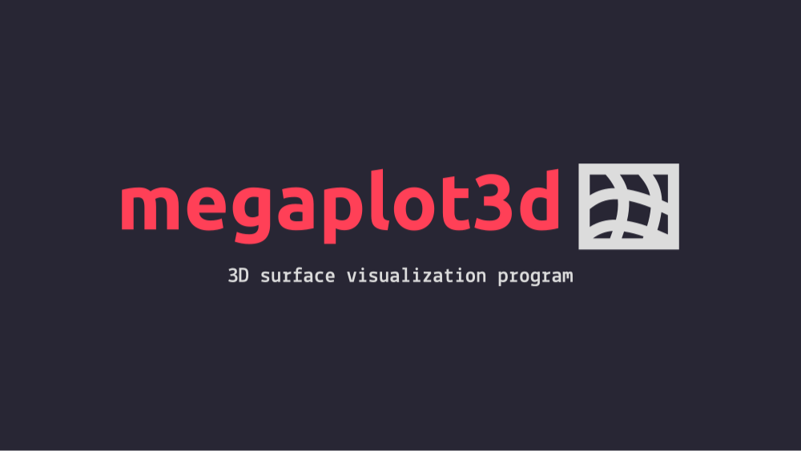
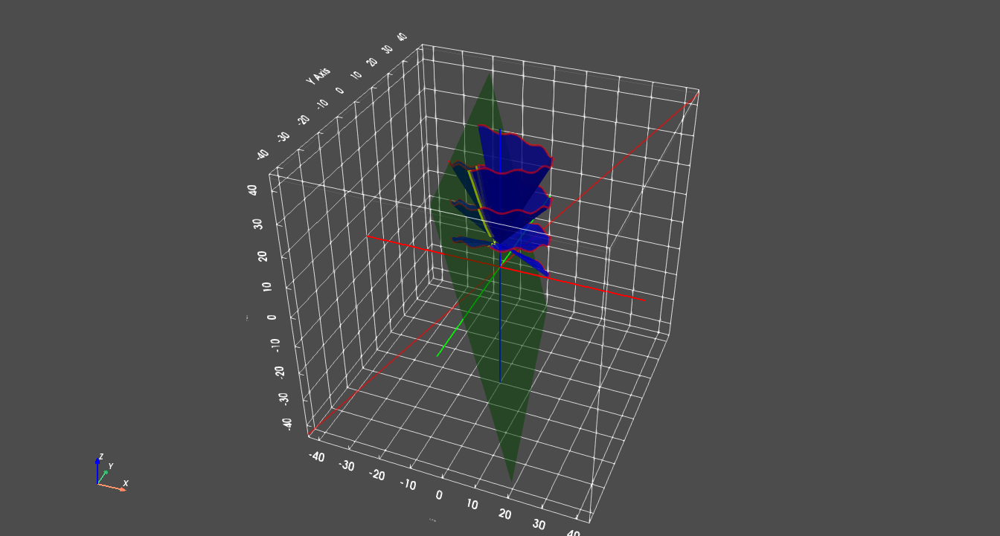

- tegs: #Python #[[My projects]] #KHPI
-
- 
-
- ## О проекте
- ------
- Проектная работа на 3м курсе в ХПИ.
-
- ### Цель проекта
- Создание приложения для отображения кривых и постоеных на их основе поверхностей и нахождения пересечений этих поверхностей с плоскостями
-
- ### Предназначение проекта
- Предназначен для хорошего отображения пересечений и объемных фигур. Может применяться на уроках по линейной алгебре и т.п. для визуализации различных трансформаций.
-
- Ссылка на git [репозиторий](https://gitlab.com/megaplot3d/megaplot3d-app)
-
-
- Примеры работы программы на момент ==09.04.2023==
- 
-
-